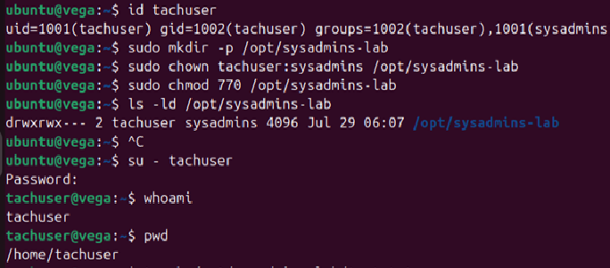
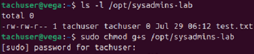
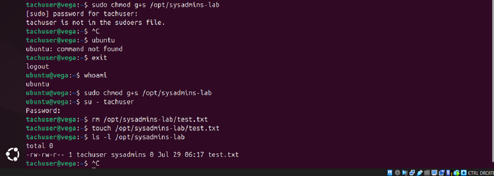

# Linux User and Permission Management

## 📌 Objective

The purpose of this lab is to learn how to manage Linux users, groups, ownership and file permissions on an Ubuntu Server system.

This exercise demonstrates fundamental Linux administration tasks commonly performed by system administrators.

---

## 🖥️ Lab Environment

| Component | Value |
|-----------|-------|
| Host OS | Windows 11 |
| Hypervisor | Oracle VirtualBox 7.2.12 |
| Guest OS | Ubuntu Server 24.04 LTS |
| User account | ubuntu |
| Hostname | vega |

---

## 📋 Scenario

A new employee joins the company.

The system administrator must:

- create a dedicated user account;
- create an administration group;
- assign the user to the appropriate group;
- create a shared working directory;
- configure secure file permissions.

The objective is to apply Linux user and permission management best practices.

---

# 👤 User Creation

A dedicated administration group and a new user account were created.

```bash
sudo groupadd sysadmins
sudo useradd -m -s /bin/bash tachuser
sudo passwd tachuser
sudo usermod -aG sysadmins tachuser
```

The account was verified using:

```bash
id tachuser
```



---

# 🔒 Directory Permissions

A shared administration directory was created.

```bash
sudo mkdir -p /opt/sysadmins-lab
```

Ownership was assigned:

```bash
sudo chown tachuser:sysadmins /opt/sysadmins-lab
```

Permissions were configured:

```bash
sudo chmod 770 /opt/sysadmins-lab
```

Verification:

```bash
ls -ld /opt/sysadmins-lab
```


---

# 🔐 SGID Configuration

Initially, files created inside the shared directory inherited the user's primary group.

To ensure all new files inherit the shared administration group, the SGID bit was enabled.

```bash
sudo chmod g+s /opt/sysadmins-lab
```

Verification:

```bash
ls -ld /opt/sysadmins-lab
```

A new file was then created:

```bash
touch /opt/sysadmins-lab/test.txt
```

The group inheritance was verified:

```bash
ls -l /opt/sysadmins-lab
```



---

# 🛠️ Troubleshooting

While testing permissions, the following message appeared:

> `tachuser is not in the sudoers file.`

This occurred because the user was intentionally created as a **standard user** without administrative privileges.

This behaviour follows the **Principle of Least Privilege**, ensuring that users only receive the permissions required for their role.



---

# ✅ Result

At the end of this lab:

- A dedicated administration group was created.
- A new Linux user was configured.
- Group membership was verified.
- A shared directory was secured.
- Ownership and permissions were configured.
- SGID was enabled for automatic group inheritance.
- User permissions were successfully validated.

---

# 🛠️ Commands Used

```bash
groupadd
useradd
passwd
usermod
whoami
id
mkdir
chown
chmod
ls
touch
su
```

---

# 📚 What I Learned

During this lab I learned how to:

- Create Linux users and groups
- Assign users to secondary groups
- Configure file ownership using `chown`
- Manage file permissions using `chmod`
- Understand and apply the SGID bit
- Verify user identity and group membership
- Apply the Principle of Least Privilege
- Troubleshoot Linux permission issues

---

# 🎯 Skills Demonstrated

- Linux User Management
- Linux Group Management
- File Ownership
- Linux Permissions
- SGID
- Linux Command Line
- System Administration
- Security Best Practices
