# Secure Remote Administration with SSH

## 📌 Objective

The purpose of this lab is to install, configure and secure an OpenSSH Server on an Ubuntu system.

SSH (Secure Shell) is the standard protocol used by system administrators to securely manage Linux servers over a network.

At the end of this lab, remote administration will be possible using password authentication and SSH key authentication.

---

## 🖥️ Lab Environment

| Component | Value |
|-----------|-------|
| Host OS | Windows 11 |
| Hypervisor | Oracle VirtualBox 7.2.12 |
| Initial Guest OS | Ubuntu 24.04 LTS |
| Final Guest OS | Ubuntu 26.04 LTS |
| User account | moebyus |
| Hostname | Vega |
| Network | NAT |

---

## ⚠️ Environment Change During the Lab

The lab was initially performed using an Ubuntu 24.04 LTS virtual machine.

During the SSH configuration and testing phase, connection issues persisted despite correct SSH service configuration and network settings.

After troubleshooting, the decision was made to replace the virtual machine with a fresh Ubuntu 26.04 LTS installation in order to continue the exercise on a clean and stable environment.

The previous virtual machine was removed, and all remaining SSH configuration steps were reproduced on the new Ubuntu 26.04 LTS system.

---

## 📋 Scenario

A new Ubuntu system has been deployed inside a test infrastructure.

Instead of managing the machine locally with a keyboard and monitor, the system administrator must enable secure remote access using SSH.

The server will first be tested with password authentication before being secured using SSH key authentication.

---

# 🔍 SSH Service Verification

The first step consisted of checking whether the OpenSSH service was installed and running.

```bash
systemctl status ssh

---

## ▶️ Starting the SSH Service

The SSH service was started manually using `systemctl`.

```bash
sudo systemctl start ssh
```

The service status was verified afterwards.

The output confirmed that:

- the SSH daemon was running;
- the server was listening on TCP port **22**;
- remote SSH connections were now possible.

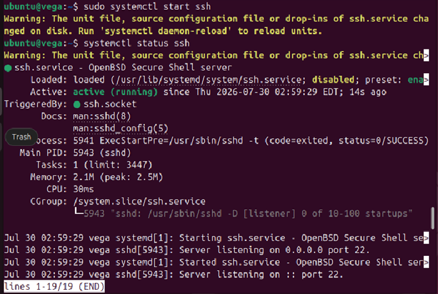

---

## 🔄 Enabling the SSH Service at Boot

To ensure remote administration remains available after a system reboot, the SSH service was configured to start automatically.

```bash
sudo systemctl enable ssh
```

The service status confirmed that SSH was now enabled at boot.

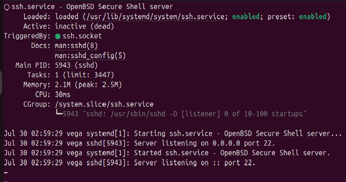

---

## 🌐 Verifying the Listening Port

To confirm that the SSH server was accepting incoming connections, the listening ports were inspected.

```bash
sudo ss -tlnp | grep :22
```

The output confirmed that:

- the SSH daemon was listening on TCP port **22**;
- the service was accepting connections on both IPv4 and IPv6;
- the server was ready for remote administration.

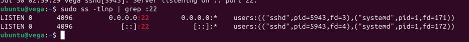

---

## 🌐 Configuring Port Forwarding

The virtual machine was configured in **NAT** mode.

To allow SSH connections from the Windows host, a VirtualBox port forwarding rule was created.

| Host Port | Guest Port | Protocol |
|-----------|-----------:|----------|
| 2222 | 22 | TCP |

This configuration forwards incoming connections on port **2222** of the Windows host to the SSH service running on port **22** inside the Ubuntu virtual machine.

---

## 🔌 Testing SSH Connection from Windows

The SSH connection was tested from the Windows host using the following command:

```powershell
ssh moebyus@localhost -p 2222
```

The connection was successfully established through the VirtualBox NAT port forwarding rule.

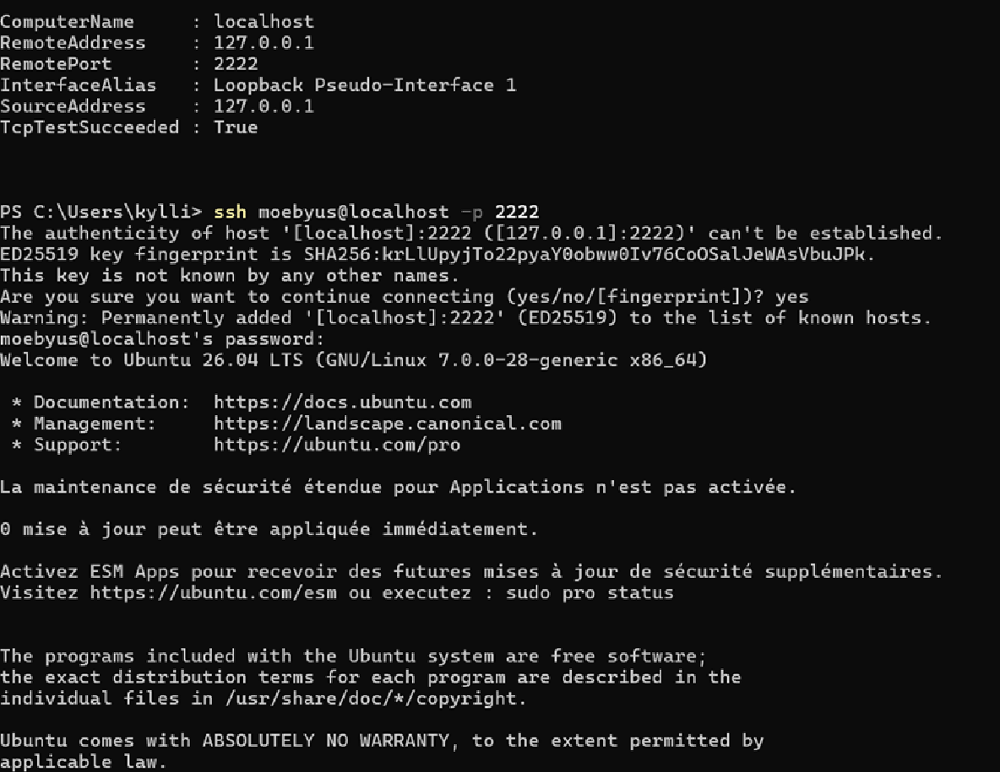

---

## 🔑 SSH Key Authentication

To improve security, SSH key authentication was configured.

An **Ed25519** key pair was generated on the Windows client:

```powershell
ssh-keygen -t ed25519
```

The public key was then copied to the Ubuntu server and stored in:

```text
~/.ssh/authorized_keys
```


A new SSH connection was tested from the Windows host.

The authentication succeeded using the SSH key without prompting for the user's password.

```powershell
ssh moebyus@localhost -p 2222
```

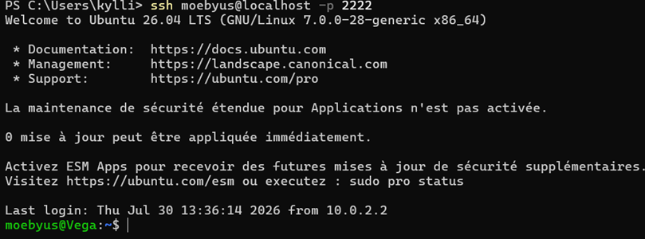

---

# 🔒 SSH Hardening: Disabling Password Authentication

Once SSH key authentication was successfully validated, password-based authentication was disabled to improve the security of the SSH service.

Using SSH keys instead of passwords reduces the risk of brute-force attacks and ensures that only authorized clients with the private key can access the server.

---

## ⚙️ Updating SSH Configuration

The SSH daemon configuration file was edited:

```bash
sudo nano /etc/ssh/sshd_config
```

The following directive was modified:

Before:

```text
PasswordAuthentication yes
```

After:

```text
PasswordAuthentication no
```

This configuration disables password authentication and forces users to authenticate using their SSH key pair.

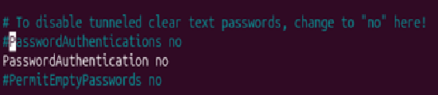

---

## 🔄 Restarting the SSH Service

After modifying the configuration file, the SSH service was restarted to apply the changes.

```bash
sudo systemctl restart ssh
```

The service status was checked:

```bash
systemctl status ssh
```

The SSH daemon restarted successfully with the new security configuration.

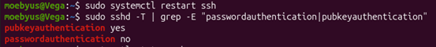

---

## ✅ Testing SSH Key Authentication After Hardening

A new SSH connection was initiated from the Windows host:

```powershell
ssh moebyus@localhost -p 2222
```

The connection was successfully established without requesting the user's password.

Authentication was performed using the previously configured Ed25519 SSH key.

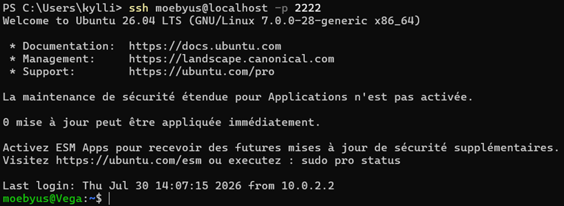

---

## 🔎 Verifying SSH Security Configuration

The effective SSH configuration was verified to confirm that password authentication was disabled and public key authentication remained enabled.

```bash
sudo sshd -T | grep -E "passwordauthentication|pubkeyauthentication"
```

The output confirmed:

```text
passwordauthentication no
pubkeyauthentication yes
```

This confirms that:

- password authentication is disabled;
- public key authentication remains enabled;
- SSH remote administration is now restricted to authorized SSH keys.


---

# 🔍 SSH Security Checks

After hardening the SSH service, additional security checks were performed to verify the SSH configuration and authentication files.

---

## 🔐 Checking SSH File Permissions

SSH requires strict permissions on authentication files to prevent unauthorized modifications.

The permissions of the SSH directory and the authorized keys file were checked:

```bash
ls -la ~/.ssh
```

The output confirmed the correct permissions:

- `.ssh` directory: `700`
- `authorized_keys` file: `600`

These permissions ensure that only the user account can access and modify SSH authentication files.

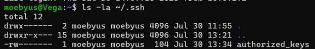

---

## 📋 Reviewing SSH Authentication Logs

SSH authentication events were reviewed using the system journal:

```bash
sudo journalctl -u ssh -n 50
```

The logs confirmed successful SSH key-based authentications.

The following entries confirmed that the Ed25519 public key was used:

```text
Accepted publickey for moebyus ... ED25519
```

The logs also showed SSH session creation events for the user account.

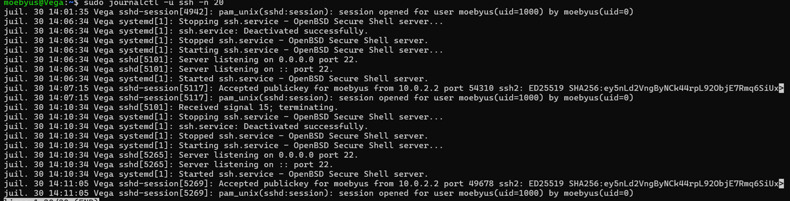

---

## 🔎 Verifying Effective SSH Security Configuration

The active SSH configuration was checked to confirm the authentication methods enabled by the SSH daemon.

```bash
sudo sshd -T | grep -E "passwordauthentication|pubkeyauthentication"
```

The output confirmed:

```text
passwordauthentication no
pubkeyauthentication yes
```

This verifies that:

- password authentication is disabled;
- public key authentication is enabled;
- SSH access is restricted to authorized cryptographic keys.

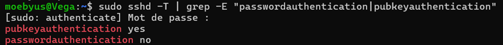

---

# 📋 Final SSH Security Summary

The SSH hardening process was successfully completed.

| Security Measure | Status |
|-----------------|--------|
| OpenSSH server installed | ✅ |
| SSH service running | ✅ |
| SSH enabled at system startup | ✅ |
| VirtualBox NAT port forwarding configured | ✅ |
| Remote SSH connection tested | ✅ |
| Ed25519 SSH key authentication configured | ✅ |
| Password authentication disabled | ✅ |
| SSH file permissions verified | ✅ |
| SSH authentication logs reviewed | ✅ |
| Effective SSH configuration verified | ✅ |

---

# 📝 Conclusion

This lab demonstrated the deployment, configuration and securing of an SSH server on Ubuntu.

The final configuration provides secure remote administration through:

- SSH key-based authentication using Ed25519;
- disabled password authentication;
- protected SSH authentication files;
- verification of SSH security settings and authentication logs.

The Ubuntu server is now configured for secure remote administration.
