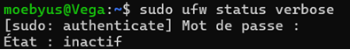
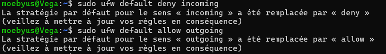
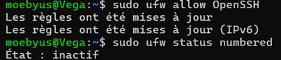
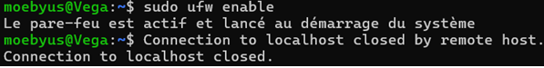
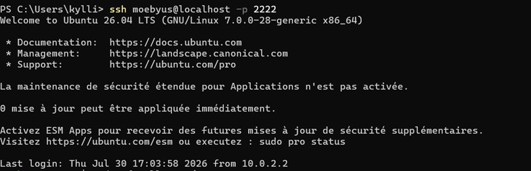
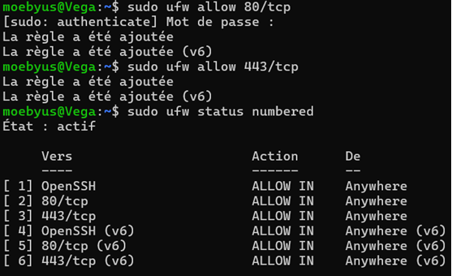

# 🔥 Linux Firewall Management with UFW

## 📌 Objective

The purpose of this lab is to learn how to configure and manage the **Uncomplicated Firewall (UFW)** on an Ubuntu Linux system.

A firewall is one of the most important security mechanisms on a Linux server. It controls incoming and outgoing network traffic by allowing only authorized connections while blocking unauthorized access.

At the end of this lab, the firewall will be configured following the **Principle of Least Privilege**, allowing only the required network services while maintaining secure remote administration through SSH.

---

## 🖥️ Lab Environment

| Component | Value |
|-----------|-------|
| Host OS | Windows 11 |
| Hypervisor | Oracle VirtualBox 7.2.12 |
| Guest OS | Ubuntu 26.04 LTS |
| User account | moebyus |
| Hostname | Vega |
| Network | NAT |
| Firewall | UFW (Uncomplicated Firewall) |

---

## 📋 Scenario

A newly deployed Ubuntu server must be secured before being placed into production.

The system administrator has been asked to configure a firewall that blocks unauthorized network traffic while allowing only the services required for administration and future deployment.

The firewall configuration must follow the **Principle of Least Privilege**, ensuring that every network service is explicitly authorized before becoming accessible.

---

# 🔍 Initial Firewall Verification

Before configuring the firewall, the current UFW status was checked to verify whether the firewall was already active.

The following command was executed:

```bash
sudo ufw status verbose
```

The output confirmed that the firewall was **inactive**, meaning that no filtering rules were currently enforced.



---

## 🔎 Reviewing the Current Firewall Configuration

The underlying firewall configuration was inspected before applying any security policy.

```bash
sudo ufw show raw
```

This command displays the raw iptables rules managed by UFW.

At this stage, the firewall contained only the default ACCEPT policies, confirming that no filtering rules had yet been applied.

---

# 🔒 Configuring the Firewall Default Policies

Before enabling the firewall, the default security policies were configured.

Following the **Principle of Least Privilege**, all incoming connections were denied by default, while outgoing connections remained allowed.

The following commands were executed:

```bash
sudo ufw default deny incoming
sudo ufw default allow outgoing
```

The default policies were successfully updated.

Although the firewall was still inactive, these settings would automatically be applied once UFW was enabled.



---

## 🔑 Allowing SSH Connections

Since the server is administered remotely through SSH, the SSH service had to be authorized before enabling the firewall.

This precaution prevents administrators from accidentally locking themselves out after activating UFW.

The following command was executed:

```bash
sudo ufw allow OpenSSH
```

The configured rules were verified afterwards.

```bash
sudo ufw status numbered
```

The output confirmed that the SSH rule had been successfully added to the firewall configuration.



---

## 🚀 Enabling the Firewall

After configuring the default policies and allowing SSH access, the firewall was enabled.

```bash
sudo ufw enable
```

UFW displayed a warning indicating that enabling the firewall could disrupt existing SSH connections.

Since the SSH rule had already been configured, the firewall was safely activated without interrupting remote administration.



---

## 🔌 Testing Remote SSH Access

After enabling the firewall, a new SSH connection was initiated from the Windows host.

```powershell
ssh moebyus@localhost -p 2222
```

The connection was successfully established through the existing VirtualBox NAT port forwarding rule.

This verification confirmed that the firewall configuration allowed secure remote administration while protecting the server from unauthorized incoming connections.



---

# ➕ Managing Firewall Rules

To simulate the configuration of a future web server, additional firewall rules were created.

HTTP and HTTPS traffic were authorized using the following commands:

```bash
sudo ufw allow 80/tcp
sudo ufw allow 443/tcp
```

The configured rules were verified afterwards.

```bash
sudo ufw status numbered
```

The output confirmed that the firewall now allowed:

- SSH for remote administration;
- HTTP for web traffic;
- HTTPS for secure web traffic.



---

## 🗑️ Removing a Firewall Rule

To demonstrate firewall rule management, the HTTP rule was removed.

The configured rules were first listed with their corresponding numbers.

```bash
sudo ufw status numbered
```

The selected rule was then deleted.

```bash
sudo ufw delete <rule_number>
```

After removing the IPv4 rule, the corresponding IPv6 rule was also deleted to keep the firewall configuration consistent.

The firewall rules were verified once again.

```bash
sudo ufw status verbose
```

The final configuration allowed only:

- OpenSSH;
- HTTPS (TCP port 443).
  
---

# 📋 Reviewing Firewall Status and Logs

The final firewall configuration was reviewed.

```bash
sudo ufw status verbose
```

The output confirmed:

- the firewall was active;
- incoming connections were denied by default;
- outgoing connections were allowed by default;
- only the required services remained accessible.

Firewall startup events were also reviewed.

```bash
sudo journalctl -u ufw -n 20
```

The logs confirmed that the UFW service was successfully loaded during system startup.

---

## 🔄 Verifying Firewall Persistence

The virtual machine was rebooted to ensure that the firewall configuration persisted across system restarts.

After reconnecting through SSH, the firewall status was checked once again.

```bash
sudo ufw status verbose
```

The output confirmed that all firewall rules and default policies remained active after the reboot.


---

# 📋 Final Firewall Configuration Summary

| Security Measure | Status |
|-----------------|--------|
| UFW installed | ✅ |
| Firewall activated | ✅ |
| Default deny incoming policy configured | ✅ |
| Default allow outgoing policy configured | ✅ |
| SSH access authorized | ✅ |
| Remote SSH connection verified | ✅ |
| HTTP and HTTPS rules configured | ✅ |
| Firewall rule management tested | ✅ |
| Firewall logs reviewed | ✅ |
| Configuration verified after reboot | ✅ |

---

# 📝 Conclusion

This lab demonstrated how to configure and manage the **Uncomplicated Firewall (UFW)** on an Ubuntu server.

The final firewall configuration follows the **Principle of Least Privilege** by denying unsolicited incoming connections while allowing only the services required for remote administration and secure web communication.

The firewall configuration was successfully verified, tested through SSH, and confirmed to persist after a system reboot, providing a secure foundation for future Linux server deployments.
