# 📦 Linux Package Management and System Updates

## 📌 Objective

The purpose of this lab is to learn how to manage software packages and system updates on an Ubuntu Linux system.

Package management is a fundamental task for Linux system administrators. It allows administrators to install software, update security components, remove unnecessary packages and maintain a stable operating system.

At the end of this lab, package operations will be performed using APT and system maintenance tasks will be completed to keep the Ubuntu server up to date.

---

## 🖥️ Lab Environment

| Component | Value |
|-----------|-------|
| Host OS | Windows 11 |
| Hypervisor | Oracle VirtualBox 7.2.12 |
| Guest OS | Ubuntu 26.04 LTS |
| User account | moebyus |
| Hostname | Vega |
| Network | NAT |
| Package manager | APT / dpkg |

---

## 📋 Scenario

A Linux system administrator is responsible for maintaining an Ubuntu server used within a test infrastructure.

The administrator must verify the current software state, apply available security updates, install additional administration tools and remove unnecessary software.

The objective is to understand how Linux package management works and how administrators keep systems secure and operational over time.

---

# 🔍 Initial Package Verification

Before performing any maintenance operation, the package management environment was inspected.

The APT version was checked using:

```bash
apt --version
```

The output confirmed that the system uses:

```text
apt 3.2.0 (amd64)
```

APT is the main package management tool used by Ubuntu to install, update and remove software packages.

---

The available updates were then checked:

```bash
apt list --upgradable
```

The command showed that several packages were waiting for updates, including:

- `libssl3t64`
- `openssl`
- `openssl-provider-legacy`
- `python3-software-properties`
- `software-properties-common`

These updates include security-related components such as OpenSSL libraries.

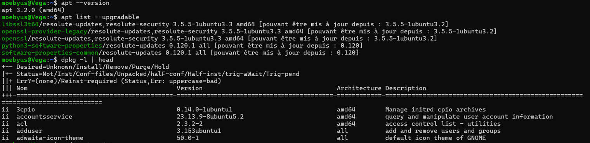

---

The installed packages database was also inspected:

```bash
dpkg -l | head
```

This command displays information about installed Debian packages.

The output confirmed that the system contains installed packages managed by `dpkg`.


---

# 🔄 Updating Package Repository Information

Before installing new software or applying updates, the package repository information was refreshed.

The following command was executed:

```bash
sudo apt update
```

The output confirmed that the Ubuntu repositories were successfully contacted:

- main Ubuntu repository;
- updates repository;
- backports repository;
- security updates repository.

The package index was successfully synchronized with the configured Ubuntu mirrors.

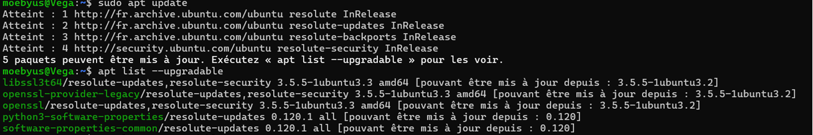

---

# ⬆️ Applying System Updates

After updating the package database, available system updates were applied.

The following command was executed:

```bash
sudo apt upgrade
```

The update process installed the following packages:

- `libssl3t64`
- `openssl`
- `openssl-provider-legacy`

These packages are related to OpenSSL cryptographic libraries and improve the security of encrypted communications.

The output confirmed that the packages were successfully upgraded.

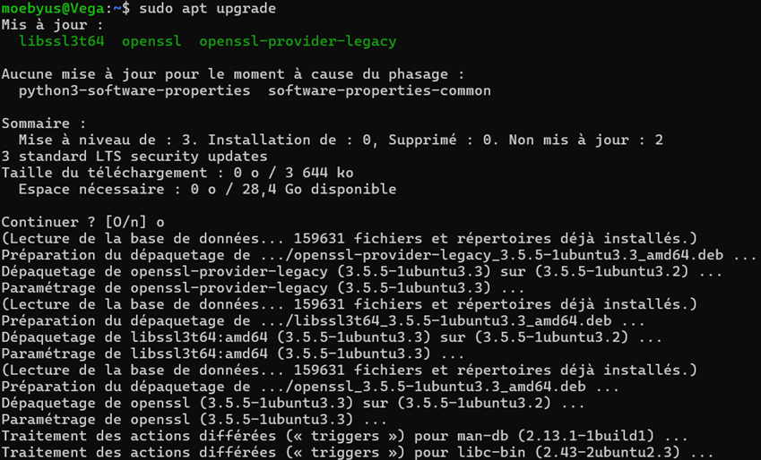

---

## 🔎 Handling Phased Updates

After applying the available upgrades, remaining updates were checked:

```bash
apt list --upgradable
```

Two packages remained pending:

```text
python3-software-properties
software-properties-common
```

Ubuntu reported that these packages were not updated because of phased deployment.

Phased updates are a mechanism used by Ubuntu to gradually distribute updates to users in order to detect potential issues before a complete rollout.

This behavior is expected and does not indicate an error.

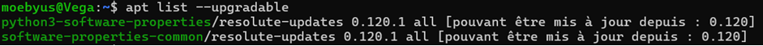

---

# 🔍 Inspecting Installed Package Information

Package details can be reviewed before or after installation using APT.

The OpenSSL package was inspected:

```bash
apt show openssl
```

The command displayed information including:

- package version;
- package origin;
- dependencies;
- repository source;
- package description.

The output confirmed that OpenSSL version:

```text
3.5.5-1ubuntu3.3
```

was installed from the official Ubuntu repositories.

OpenSSL provides cryptographic utilities used for:

- SSL/TLS communication;
- certificate management;
- encryption operations.

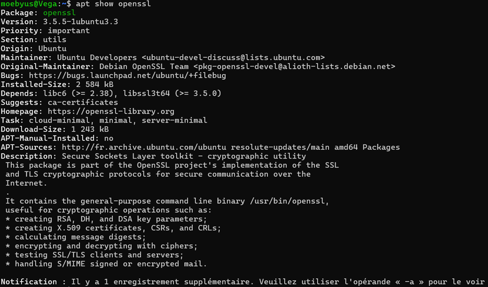

---

# 📦 Installing Administration Tools

To demonstrate package installation, the `tree` utility was selected.

`tree` is a command-line tool used to display directories and files in a hierarchical tree structure.

The following command was executed:

```bash
sudo apt install tree
```

APT verified the package state and confirmed that the latest version was already installed.

The installation status was verified using:

```bash
tree --version
```

The output confirmed that the tool was available:

```text
tree v2.3.1
```

This demonstrates that APT automatically checks package availability and prevents unnecessary reinstallation.

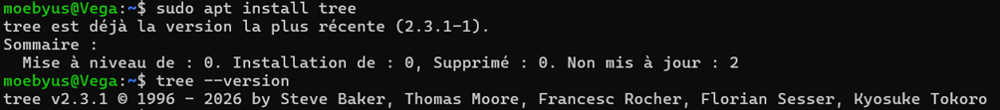

---

# 🔎 Searching for Available Packages

Before installing additional software, available packages can be searched using APT.

The following command was executed:

```bash
apt search htop
```

The search results showed several system monitoring tools, including:

- `htop`
- `btop`
- `bpytop`
- `bashtop`

The output confirmed that `htop` was already installed on the system:

```text
htop/resolute,now 3.4.1-5build2 amd64 [installé]
```

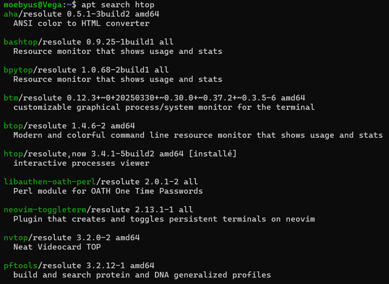

---

# 📊 Installing and Verifying htop

The `htop` package was used as an example of a system administration utility.

The installation command was executed:

```bash
sudo apt install htop
```

APT confirmed that the package was already installed and up to date.

The installed version was verified:

```bash
htop --version
```

The output confirmed:

```text
htop 3.4.1
```

`htop` provides an interactive process viewer that allows administrators to monitor:

- running processes;
- CPU usage;
- memory usage;
- system activity.

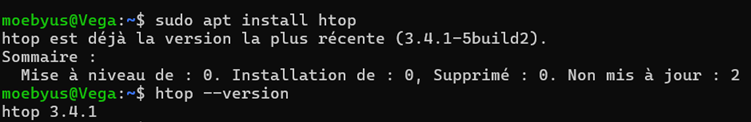

---

# 🗑️ Removing Software Packages

To demonstrate package removal, the `htop` utility was removed from the system.

The following command was executed:

```bash
sudo apt remove htop
```

APT removed the package and released the associated disk space.

The removal was verified:

```bash
htop --version
```

The command returned:

```text
-bash: /usr/bin/htop: Aucun fichier ou dossier de ce nom
```

This confirmed that the package had been successfully removed.

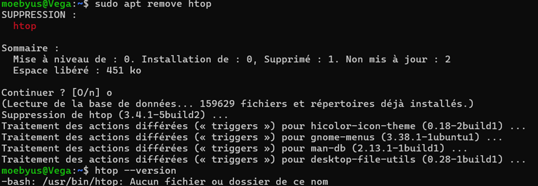

---

# 🧹 Cleaning Unused Dependencies

After removing software, unused dependencies can be cleaned using:

```bash
sudo apt autoremove
```

The command checks for packages that are no longer required by the system.

In this case, no unnecessary dependencies were found.

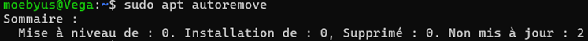

---

# 🔎 Final System Verification

After completing the package management operations, the final system state was verified.

The remaining available updates were checked:

```bash
apt list --upgradable
```

The output showed:

```text
python3-software-properties
software-properties-common
```

These packages were still waiting for updates because of Ubuntu phased deployment.

No package management error was detected.

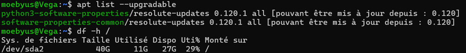

---

## 💾 Checking Disk Usage

The available disk space was verified to ensure that the maintenance operations did not impact storage capacity.

The following command was executed:

```bash
df -h /
```

The output confirmed:

```text
Filesystem      Size  Used  Avail  Use%
/dev/sda2        40G   11G    27G   29%
```

The Ubuntu system still has sufficient free space available for future package installations and updates.


---

# 📋 Final Package Management Summary

The Linux package management process was successfully completed.

| Package Management Task | Status |
|-------------------------|--------|
| APT version verified | ✅ |
| Installed packages inspected with dpkg | ✅ |
| Package repositories updated | ✅ |
| System packages upgraded | ✅ |
| Security-related packages updated | ✅ |
| Phased updates identified and analyzed | ✅ |
| Package information inspected with apt show | ✅ |
| Administration tool installation verified | ✅ |
| Package search performed with apt search | ✅ |
| Software removal tested | ✅ |
| Unused dependencies checked | ✅ |
| Final system state verified | ✅ |
| Disk usage checked | ✅ |

---

# 📝 Conclusion

This lab demonstrated the management of Linux software packages using **APT** and **dpkg** on an Ubuntu server.

The main package administration operations were performed:

- updating package repositories;
- applying system upgrades;
- inspecting package information;
- installing and removing software;
- cleaning unused dependencies;
- verifying system maintenance status.

The exercises also demonstrated real-world Ubuntu behavior through phased updates, showing how security and stability are maintained during software deployment.

The Ubuntu server is now maintained using standard Linux package management practices, providing a clean and controlled environment for future administration tasks.
