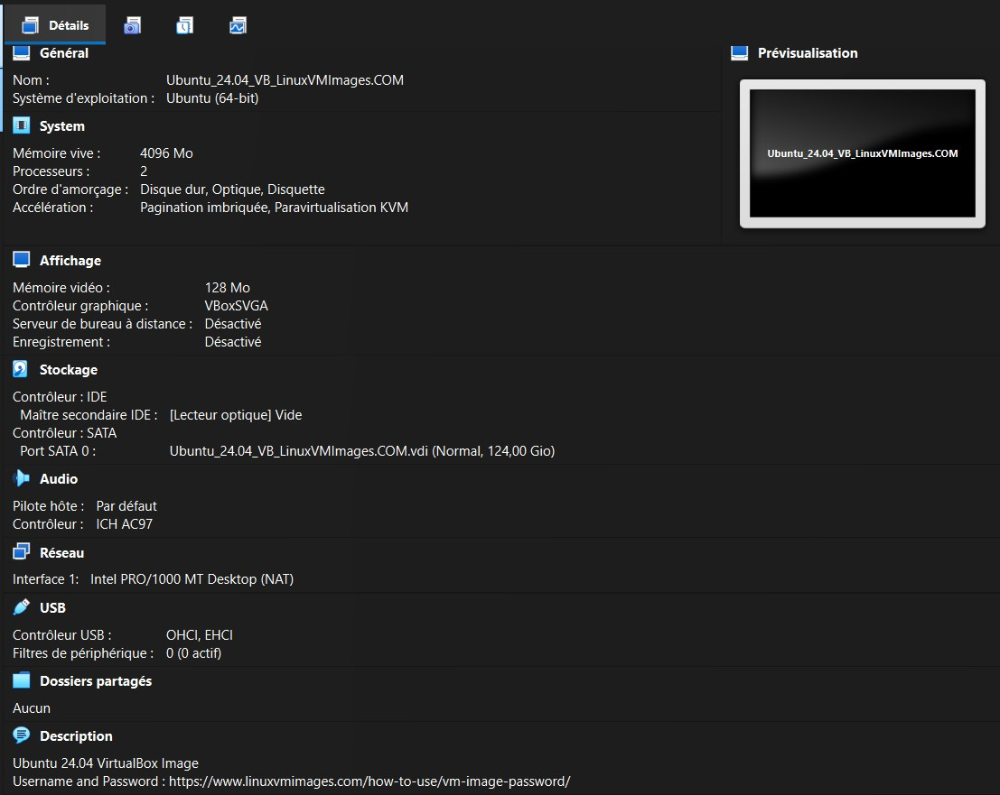

# Ubuntu Server Installation on VirtualBox

## 📌 Objective

The purpose of this lab is to install an Ubuntu Server virtual machine using Oracle VirtualBox and prepare a stable environment for future Linux, networking and cybersecurity labs.
---

## 🖥️ Lab Environment

| Component | Value |
|-----------|-------|
| Host Operating System | Windows 11 |
| Hypervisor | Oracle VirtualBox 7.2.12 (r174389) |
| Guest Operating System | Ubuntu Server 24.04 LTS |
| Network Mode | NAT |
---

## 🎯 Learning Objectives

By completing this lab, I aim to:

- Create and configure a virtual machine using Oracle VirtualBox.
- Install Ubuntu Server 24.04 LTS.
- Understand the role of virtual hardware (CPU, RAM, storage, network).
- Verify that the operating system is correctly installed.
- Prepare a clean environment for future Linux and networking labs.
---

## 🖥️ Step 1 – Create the Virtual Machine

The first step is to create a new virtual machine using Oracle VirtualBox.

### Virtual Machine Configuration

| Setting | Value |
|---------|-------|
| Name | Ubuntu_24.04_VB_LinuxVMImages.COM |
| Type | Linux |
| Version | Ubuntu (64-bit) |
| Memory | 4096 MB |
| Processors | 2 vCPU |
| Virtual Disk | 25 GB (Dynamically Allocated VDI) |
| Network | NAT |

### Why these settings?

- **4096 MB of RAM** provides enough memory for Ubuntu Server while leaving sufficient resources for the host operating system.
- **2 virtual CPUs** offer good performance for administration and networking labs.
- A **25 GB dynamically allocated virtual disk** optimizes disk space usage while providing enough storage for future experiments.
- **NAT networking** allows the virtual machine to access the Internet without requiring additional network configuration.
  
### Virtual Machine Overview

